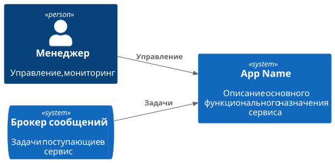
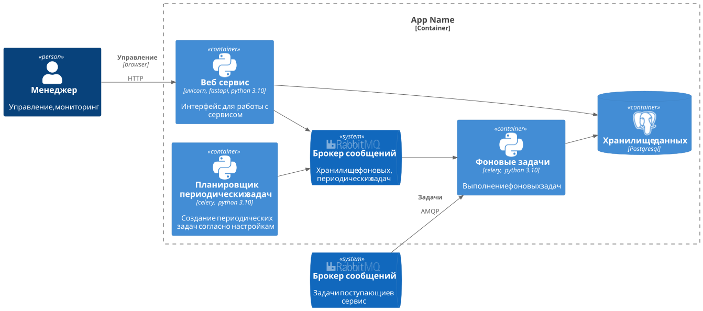

# Task Manager

* Описание сервиса
* Ссылка на страницу confluence

### C4 модель - Архитектура системы



### C4 модель - Архитектура контейнеров



### Разработка
* Для начала разработки необходимо чтобы у вас был установлен make
  * В Unix-подобных системах (включая Nix) - **make**
  * В Windows (используя командную строку или PowerShell) - **nmake**

* Доступны следующие команды
	* make venv - Создание виртуального окружения
	* make install - Установка зависимостей back
  * make install-front - Установка зависимостей front
	* make migrate - Запуск миграции
	* make generate-migration message=MIGRATION_NAME - Создание новой миграции Alembic
	* make update - Обновление текущей ветки git из dev
	* make test - Запуск тестов
  * make git-init - Инициализация git репозитория
  * make pre-commit-install  - установка автоматического запуска проверки кода перед каждым коммитом
	* make docker-up - Запустить проект с помощью docker-compose
	* make celery-beat - Запустить планировщик Celery Beat
	* make celery-worker queue=QUEUE_NAME - Запустить worker Celery
	* make init - Инициировать проект
	* make dev - Запуск обновления, установка зависимостей, запуск миграции

Для начала разработки необходимо:
  - переимнованием env.example в **.env** прописвыаем все зависимости.
  - запустить команду ```make init```
  - настроить IDE

### Тесты

* Для запуска тестов
  - прописвыаем в **.env.test** все зависимости.
  - запустить команду ```make test```
